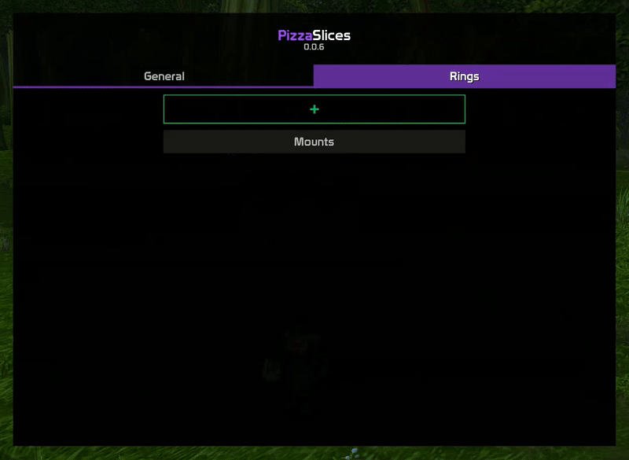

# 🍕 PizzaSlices

Radial action menus for [TurtleWoW](https://turtle-wow.org). A simplified [OPie](https://www.curseforge.com/wow/addons/opie) clone.


## Install

1. Download and extract [latest version](https://github.com/Pizzahawaiii/PizzaSlices/archive/main.zip)
2. Copy the "PizzaSlices-main" folder to `<WoW>/Interface/AddOns` and rename it to "PizzaSlices"
3. (Re)start WoW

## Version Upgrade

To update to the latest version, delete your `<WoW>/Interface/AddOns/PizzaSlices` folder and follow the [installation steps](#install) again.

Check the [commit history](https://github.com/Pizzahawaiii/PizzaSlices/commits/main) to see the latest changes.

## Features

PizzaSlices lets you create custom rings, fill them with various types of actions and bind them to different keys. It doesn't reuse any of your existing action buttons so you won't lose any of that precious action bar space.

### Raid Marks


Assign any raid marks quickly and easily with the press of a single button, not matter if you're using [SoloRaidTargetIcons](https://github.com/refaim/SoloRaidTargetIcons) or in a group/raid. There's also a special action to instantly clear all previously assigned raid marks.
<br clear="left"/>

### Abilities


You can add all your active abilities to rings. Buffs, auras, hunter aspects, or even damage and healing abilities if you really want to - go crazy!
<br clear="left"/>

### Mounts


All your mounts can be added to rings as well, anything you see in the 'Mounts' tab in your spellbook.
<br clear="left"/>

### Toys & Companions


Anything from the 'Toys' and 'Companions' tabs in your spellbook can also be added to rings.
<br clear="left"/>

### Professions & General


Your professions and anything else listed in the 'General' tab of your spellbook are available as well. Excluding passive abilities, obviously.
<br clear="left"/>

### ItemRack Sets


If you're using ItemRack, you can also add your gear sets to rings to quickly change outfits on the fly.
<br clear="left"/>

## Settings

Use one of the following commands to open the settings menu:

```
/ps
/slices
/pizzaslices
```

### Add Stuff to a Ring




On the 'Rings' tab, click on the green + or on the name of one of the existing rings. Select one of the categories on the right. Then, drag & drop any of the abilities/mounts/macros/... from the center into the ring area on the left (purple background). Finally, click 'Save'.
<br clear="left"/>

### Remove Stuff from a Ring


To remove an item from a ring, simply drag & drop it into the red trash can area that appears when you start dragging it away from the ring section (purple background).
<br clear="left"/>

## Contact

You're always more than welcome to ask questions or provide any kind of feedback.

- **Turtle Discord**: Pizzahawaii
- **Nordanaar**: Pizzahawaii, Pizzamista, Pizzapimp, Pizzapaws, Pizzapog<br />If you see anyone whose name starts with 'Pizza', chances are it's me. 

## Acknowledgements

Thanks to [foxlit](https://www.curseforge.com/members/foxlit) for the inspiration! 🚀

Thanks to all the beta testers for providing valuable feedback! ♥️

- Hersi/blu5hit
- Cliffholger
- Lo5t1ncyb3r
- mentalxpc
- rooti
- Ténébreux
- Zcoobee
